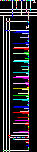
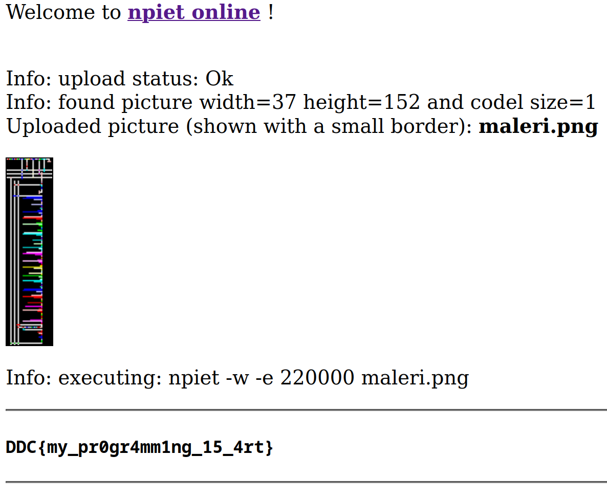

# Esoterisk Maleri 
**Proposed difficulty**: Easy

Det her maleri virker godt nok abstrakt og esoterisk, hvordan mon det skal fortolkes?

[maleri.png](./maleri.png)

## Walkthrough - Introduction
This challenge provides an image that seemingly makes it look like a steg challenges, but in reality it actually code the the esoteric programming language `Piet`. The Piet program provided can be seen here:

In Piet each block of color called a `codel` (To make it clear that we are talking about a "block" of pixels instead of each pixel), where the number of codels next to each other (NSEW) chain together and make up a number. A bunch of various operations can be done to codels depending on the hue and color change of the next codel block. Check out [this website](https://www.dangermouse.net/esoteric/piet.html) to find out more about Piet.

## Walkthrough - Solution
To run the program you can go to [npiet online](https://www.bertnase.de/npiet/npiet-execute.php) and upload the program:

## Flag
`DDC{my_pr0gr4mm1ng_15_4rt}`