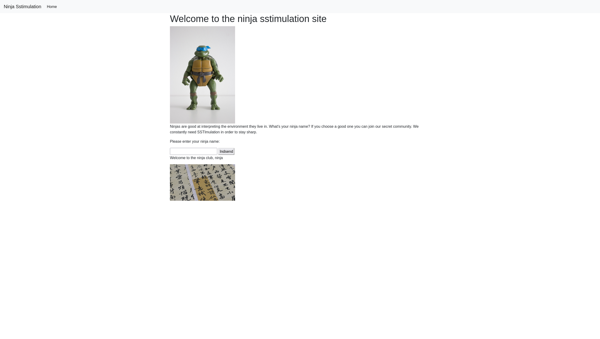
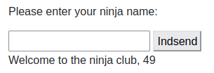
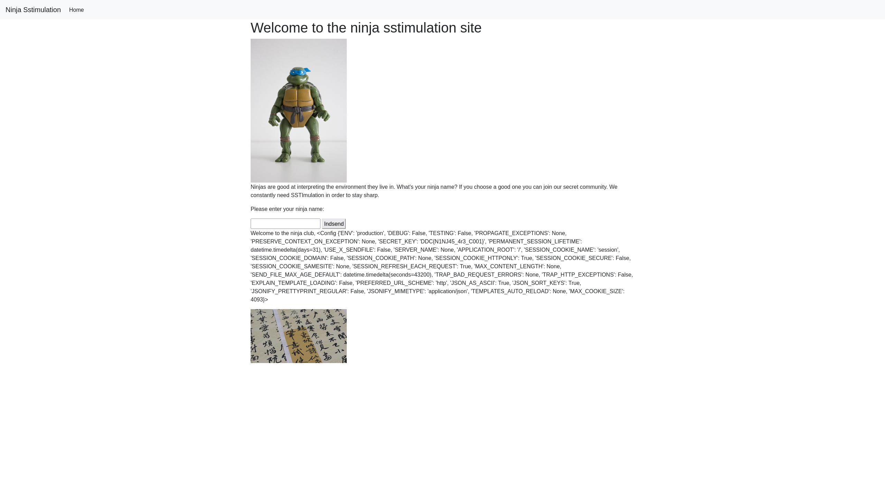

# Ninja SSTImulation 
**Proposed difficulty**: Easy

Ninjas have started to adopt modern recruitment techniques. Perhaps you can uncover their secrets at `ninjalair.hkn`

## Walthrough - Introduction
This website is about `Server Side Template Injection (SSTI)`, where an attack is able to inject template syntax into a website. Template syntax makes it easier for developers to connect code into e.g. HTML - essentially having HTML and code in on, often using the pattern `{{ <something in here> }}`. 

## Walkthrough - Solution
When accessing `ninjalair.hkn` we are greated with a home page that has an input field as seen below:

Both the name and the text on the website heavily hints at `SSTI`, so looking at the [SSTI](https://book.hacktricks.xyz/pentesting-web/ssti-server-side-template-injection#jinja2-python) page on HackTricks a few options are presented to both to confirm that SSTI is possible and how to take advantage of it. Firstly testing that SSTI is possible using `{{7*7}}` should hopefully give it `49` back, which it does:

Now, we essentially have a runtime within the Jinja2 environment, so we can try to see what the `config` variable contains using `{{config}}` - This variable contains a lot of configuration information about the curring Jinja2 environment. I now present to you, the flag:

## Flag
`DDC{N1NJ45_4r3_C001}`