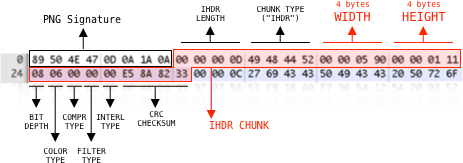
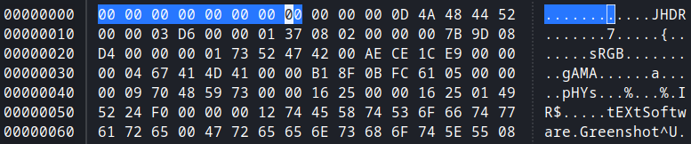
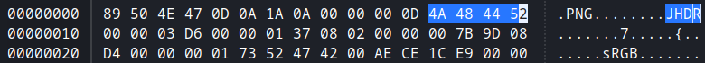
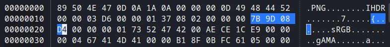
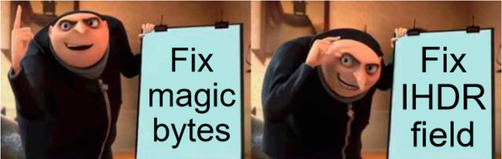
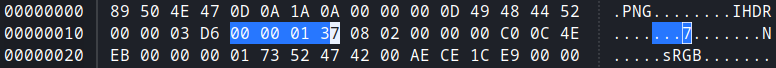
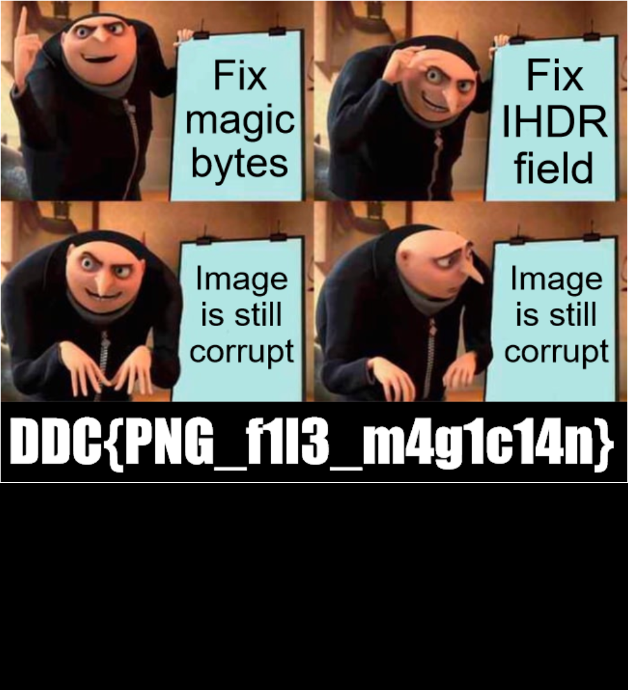

# PNG Magic 

**Proposed difficulty**: Medium

Moldevort har forhekset mit billede, og jeg kan ikke åbne det!

Snup en tryllestav og en PNG-filspecifikation og vis mig, hvad du dur til!

[magic.png](./magic.png)

## Walkthrough - Introduction
This challenge gives us a PNG file that has been corrupted. Firstly the introduction tells us to get the PNG-specification, so we do that. Below is an image of how a PNG header should look like/contain:



Now, we know that the PNG file signature has to look exactly like on the image, but we have to remember that everything after the `chunk type` in the red box in the image might be something that we have to adjust manually.

## Walkthrough solution
When trying to open the image we are greated with an error. Firstly using the utility `pngcheck` can help guide us through what is missning in the image:
```
$ pngcheck magic.png 
magic.png  this is neither a PNG or JNG image nor a MNG stream
ERROR: magic.png
```
Opening the image up in a hexedit like `ghex` we can see that the file signature that was supposed to be `89 50 4E 47 0D 0A 1A 0A` is `00 00 00 00 00 00 00 00` as seen below:




With the proper file signature checking with signature check now gives us:
```
$ pngcheck magic.png 
magic.png  first chunk must be IHDR
ERROR: magic.png
```

We get this error because the 3rd segment labeled as "chunk data" in the PNG header figure is not `IHDR`, but rather `JHDR`. As seen below the chunk type is set to `4A 48 44 52`, when it should have been `49 48 44 52`:



Check with pngcheck again we now get:
```
$ pngcheck magic.png
magic.png  CRC error in chunk IHDR (computed c00c4eeb, expected 7b9d08d4)
ERROR: magic.png
```

We not get the wrong checksum because we can see that the CRC checksum set within the file is set to `7B 9D 08 D4`, but was actually computed to being `C0 0C 4E EB`, which in the real worth would indicate some kind of corruption. 



Now we have finally gotten a proper image file that can be opened, given the pngcheck output of:

```
$ pngcheck magic.png
OK: magic.png (982x311, 24-bit RGB, non-interlaced, -21.9%).
```

The image we now get is:


While we have a working image we have another problem! The full image is not displayed, which is hinted at by the white borders. We have a white border on the two sides and the top, but not the button. This means that we have to edit the height of the image, refer to the PNG header image. Currently it is set to `00 00 01 37`, but as we can see that is not big enough, so we can change it to a bigger number, say `00 00 04 37`:



As expected we now get another CRC error when running pngcheck on the image, which is caused by the fact that we have changed the file resulting in a different computed CRC checksum as outputted:

```
$ pngcheck magic.png
magic.png  CRC error in chunk IHDR (computed 9234614c, expected c00c4eeb)
ERROR: magic.png
```

Simply checking the CRC checksum from `C0 0C 4E EB` to `92 34 61 4C` the same way as done earlier will now yield us this image:



Which gives up the flag.

## Flag
`DDC{PNG_F1L3_M4G1C14N}`